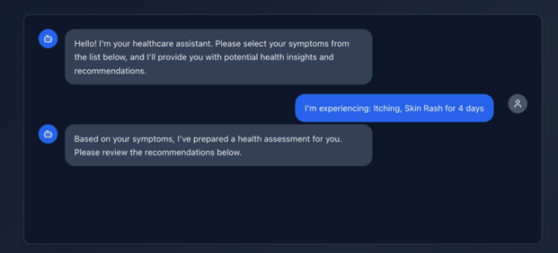

# Healthcare Chatbot - Refactored Version

An intelligent healthcare chatbot designed for symptom-based preliminary diagnosis, with a clean separation between model training and chat interaction, offering insightful visualizations and an enhanced user experience.

## 📁 Project Structure

```
healthcare-chatbot/
├── Data/
│   ├── Training.csv          # Training dataset
│   └── Testing.csv           # Testing dataset
├── MasterData/
│   ├── symptom_Description.csv    # Disease descriptions
│   ├── symptom_severity.csv       # Symptom severity scores
│   └── symptom_precaution.csv     # Recommended precautions
├── models/                         # Generated after training
│   ├── best_model_*.pkl           # Trained model
│   ├── label_encoder.pkl          # Label encoder
│   ├── feature_names.pkl          # Feature names
│   └── model_summary.pkl          # Training summary
├── model_training.ipynb           # Model training notebook
├── chat_bot.py                    # Interactive chatbot
├── data_exploration.ipynb         # Data analysis (from previous conversation)
└── README.md                      # This file
```

## 🚀 Quick Start

### 1. Train the Model

First, run the training notebook to create and save the model:

```bash
jupyter notebook model_training.ipynb
```

Run all cells in the notebook. This will:

- Load and preprocess the data
- Train multiple models (Decision Tree, Random Forest, SVM, Naive Bayes)
- Compare their performance with visualizations
- Save the best performing model
- Generate performance reports and feature importance plots

### 2. Run the Chatbot

After training, run the interactive chatbot:

```bash
cd backend
python chat_bot.py
```

```bash
cd frontend
npm run dev
```

## 🔧 Key Improvements Made

### Model Training (`model_training.ipynb`)

- **Multiple Algorithm Comparison**: Evaluates Decision Tree, Random Forest, SVM, and Naive Bayes
- **Comprehensive Visualizations**:
  - Model accuracy comparison
  - Cross-validation scores
  - Feature importance analysis
  - Learning curves
  - Confusion matrix
  - Per-class performance metrics
- **Model Persistence**: Saves the best model and all necessary components
- **Detailed Performance Reports**: Classification reports and per-disease analysis

### Chatbot Interface (`chat_bot.py`)

- **Class-Based Architecture**: Organized into a clean `HealthcareChatbot` class
- **Model Loading**: Automatically loads the trained model
- **Improved User Experience**:
  - Better symptom pattern matching
  - Input validation and error handling
  - Clear prompts and feedback
  - Professional formatting
- **Enhanced Diagnosis Process**:
  - Initial prediction based on primary symptom
  - Follow-up questions for related symptoms
  - Final prediction with confidence scores
  - Severity assessment based on duration
- **Removed Text-to-Speech**: Cleaner console-based interface
- **Better Error Handling**: Graceful handling of missing files and invalid inputs

## 📊 Model Performance Features

The training notebook provides extensive performance analysis:

1. **Accuracy Metrics**: Training, validation, and test accuracy
2. **Cross-Validation**: 5-fold cross-validation with error bars
3. **Feature Importance**: Identifies most predictive symptoms
4. **Learning Curves**: Shows how model performance scales with data
5. **Confusion Matrix**: Detailed prediction accuracy per disease
6. **Per-Class Metrics**: Precision, recall, and F1-score for each disease

## 💡 Usage Tips

### For Model Training:

- The notebook will automatically select the best performing model
- All visualizations are saved and displayed inline
- Models are saved in the `models/` directory
- Training typically takes 2-5 minutes depending on system

### For Chatbot Usage:

- Start with your most prominent symptom
- Answer follow-up questions honestly
- The system will suggest the most likely condition
- Always consult a healthcare professional for actual diagnosis

## 🔬 Technical Details

### Model Selection

- **Primary Choice**: Random Forest (as requested)
- **Fallback**: Decision Tree (from original code)
- **Comparison**: Also trains SVM and Naive Bayes for comparison
- **Selection Criteria**: Highest test accuracy with good cross-validation scores

### Data Processing

- Binary symptom encoding (0/1)
- Label encoding for diseases
- Train/validation/test splits
- Feature importance ranking

### Improvements Over Original

1. **Separation of Concerns**: Training and inference are separate
2. **Better UX**: Clearer prompts and error handling
3. **Model Persistence**: No need to retrain every time
4. **Performance Insights**: Detailed model analysis
5. **Code Organization**: Clean, maintainable class structure
6. **Enhanced Features**: Confidence scores, better symptom matching

## 📋 Requirements

```python
pandas
numpy
scikit-learn
matplotlib
seaborn
joblib
jupyter
```

Install with:

```bash
pip install pandas numpy scikit-learn matplotlib seaborn joblib jupyter
```

## 🤖 Model Details

The system trains and compares multiple models:

- **Random Forest**: Ensemble method, good for medical data
- **Decision Tree**: Interpretable, fast training
- **SVM**: Good for high-dimensional data
- **Naive Bayes**: Probabilistic classifier

The best model is automatically selected and saved for use in the chatbot.

## ⚠️ Disclaimer

This chatbot is for educational and informational purposes only. It should not be used as a substitute for professional medical advice, diagnosis, or treatment. Always consult qualified healthcare professionals for medical concerns.

## 🛠️ Future Enhancements

Potential improvements you could add:

- Web interface using Flask/Django
- Confidence threshold tuning
- Symptom clustering analysis
- Multi-language support
- Integration with medical databases
- Mobile app version


## 🖼️ Chatbot Interface Screenshots

**Home Page / Landing Screen**  


**Symptom Selection**  


**Input Symptom Duration**  


**Health Recommendations Output**  


